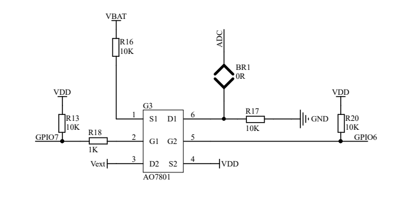
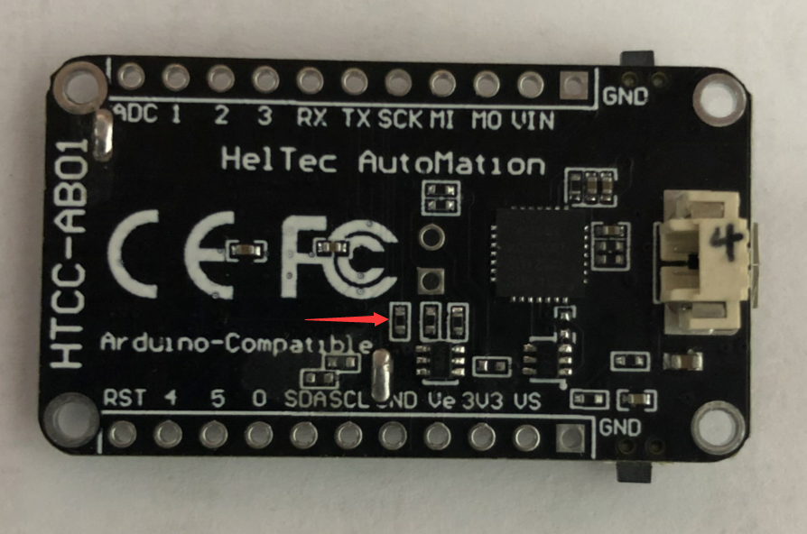

# Heltec<sup>TM</sup> CubeCell<sup>TM</sup> Series Frequently Asked Questions

This page contains the most frequently questions from user. if this page's detail can't solve your problem, you can also talk in our forum: [community.heltec.cn](http://community.heltec.cn/)

&nbsp;

## How to Access Bootloader Mode

The bootloader of CubeCell<sup>TM</sup> is preprogrammed software for burning and verification firmware. In FLASH row 0~33, rewrite this part will break the bootloader and can't download firmware anymore.

Entering the bootloader mode needs to meet the following timing (T<sub>RST</sub>≥10mS):


Here are two method access bootloader manually:

- CubeCell not connect to a computer -- Press the “USER” button of the CubeCell while plugging it to any USB port of a computer.
- CubeCell already connected to a computer -- Keep the "USER" button pressed → Press the RESET button → Release the RESET button → release the USER button.

**USER Pin map**

**[Dev-Board](https://heltec.org/project/htcc-ab01/)** -- `GPIO 7`

**[Capsule Sensor + Debug board](https://heltec.org/project/htcc-ac01/)** -- `GPIO 0`

``` Tip:: If keep USER pin keep LOW all the time (software set LOW or pull down to GND), may cause auto-boot system not working, users can access bootloader mode manually.

```

&nbsp;

## How to use the ADC pin for AnalogRead (ASR6501)

**The ASR6501 embedded 12-bit 1Msps SAR ADC, but only have one channel ADC input pin**, this pin had been used for battery voltage reading default.



In order to read other analog signal, user need remove the resistance BR1, then the ADC header will be free. 



``` Tip:: the ADC of CubeCell uses internal 1.2V reference voltage

```

``` Note:: ADC input voltage can NOT higher than VDD.

```

