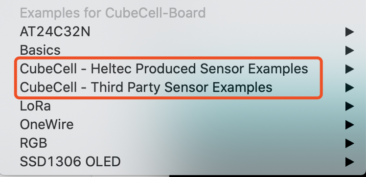

# Capsule Sensor Quick Start

## Sammary

**Pay attention to the following issues while using a capsule sensor**

- The capsule sensor itself is positioned as a small-sized, assembled and deployed sensor. It does not have programming, debugging, and other interfaces. You need to use the [Debug Board](https://heltec.org/product/cubecell-capsule-debug/) in order to program and debug the program;
- Due to storage and transportation issues, the battery is not integrated inside the capsule by default. Users in mainland China can inform our customer service when placing an order and we will provide integrated battery services.
  - [How to assemble a battery inside the Caosule Sensor](zh_CN/user_manual/assemble_a_battery)

## Get Ready
- [Correctlly install CubeCell Arduino development framework](https://heltec-automation-docs.readthedocs.io/en/latest/cubecell/quick_start.html#install-cubecell-relevant-framework)；
- A high quality Micro USB cable;
- [Connect Capsule to Debugger board](zh_CN/user_manual/connect_capsule_to_debugger)；
- Install CP2102 USB-UART bridge driver.
  - *In most cases, Windows, Mac OS, and Linux will automatically recognize the CP2102 USB-UART bridge. If it is not recognized properly, please refer to [here](https://heltec-automation-docs.readthedocs.io/en/latest/general/establish_serial_connection.html).*

## Capsule Sensor Test

### Basic Test

In the example menu `CubeCell - xxxx Sensor Examples`, is the basic test program used by capsule sensors, which can be used to quickly verify the sensor and read the value from sensors:



**Heltec Produced Sensor Examples:** Sensor modules made by Heltec; [Sensor List](https://github.com/HelTecAutomation/ASR650x-Arduino/blob/master/libraries/SensorBasic/readme.md)

**Third Party Sensor Examples:** For third-party sensor modules developed by users. [Sensor List](https://github.com/HelTecAutomation/ASR650x-Arduino/blob/master/libraries/Sensor_ThirdParty/readme.md)

&nbsp;

### Transmit Sensor Data Via LoRaWAN protocol

``` Tip:: This part operations must performed with a gateway that supports the standard LoRaWAN protocol.

```

In the example menu `LoRa → LoRaWAN → LoRaWAN_Sensors(_ThirdParty)`, we provided some examples transmit sensor's data via LoRaWAN protocol.


In all sensor & LoRaWAN examples, the sensor data is read once before sending. For example, in the HDC1080 temperature and humidity sensor example:

```c++
case DEVICE_STATE_SEND:
{
	PrepareTxFrame( AppPort ); //read data from HDC1080 sensor
	LoRaWAN.Send(); //LoRaWAN transmit
	DeviceState = DEVICE_STATE_CYCLE;
	break;
}
```
The `PrepareTxFrame` had read temperature (float), humidity (float) and battery voltage (unsigned int). And convert data to a char. The contents:

```c++
static void PrepareTxFrame( uint8_t port )
{
    pinMode(Vext,OUTPUT);
    digitalWrite(Vext,LOW);
    hdc1080.begin(0x40);
    float Temperature = (float)(hdc1080.readTemperature());
    float Humidity = (float)(hdc1080.readHumidity());
    hdc1080.end();
    digitalWrite(Vext,HIGH);
    uint16_t BatteryVoltage = GetBatteryVoltage();
    unsigned char *puc;

    puc = (unsigned char *)(&Temperature);
    AppDataSize = 10;//AppDataSize max value is 64
    AppData[0] = puc[0];
    AppData[1] = puc[1];
    AppData[2] = puc[2];
    AppData[3] = puc[3];

    puc = (unsigned char *)(&Humidity);
    AppData[4] = puc[0];
    AppData[5] = puc[1];
    AppData[6] = puc[2];
    AppData[7] = puc[3];

    AppData[8] = (uint8_t)(BatteryVoltage>>8);
    AppData[9] = (uint8_t)BatteryVoltage;

    Serial.print("T=");
    Serial.print(Temperature);
    Serial.print("C, RH=");
    Serial.print(Humidity);
    Serial.print("%,");
    Serial.print("BatteryVoltage:");
    Serial.println(BatteryVoltage);
}
```
#### Why convert data to byte?

Everyone knows that `float` data occupies 4 bytes in memory, and `unsigned int` data occupies 2 bytes. Suppose you have a very accurate sensor, for example, the measured data is 12.34567890987654321, if send this data via string like `char data[] = "27.313232421875"`, it will spend 15 bytes. but if transmit in byte `80 81 DA 41`, only spend 4 bytes.

## External resources

- Get ready a LoRa gateway
  - [How to connect HT-M01 to a LoRa server](https://heltec.org/project/ht-m01/)
  - [How to connect HT-M02 to a LoRa server](https://heltec.org/project/ht-m02/)

- [How to config LoRaWAN parameters](https://heltec-automation-docs.readthedocs.io/en/latest/cubecell/config_parameter.html)

- [Connect CubeCell to LoRaWAN Server](https://heltec-automation-docs.readthedocs.io/en/latest/cubecell/connect_to_gateway.html)

