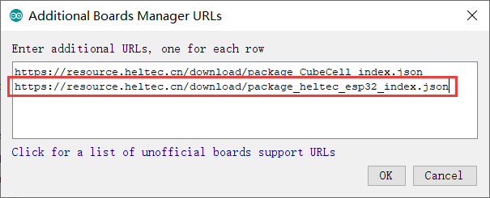
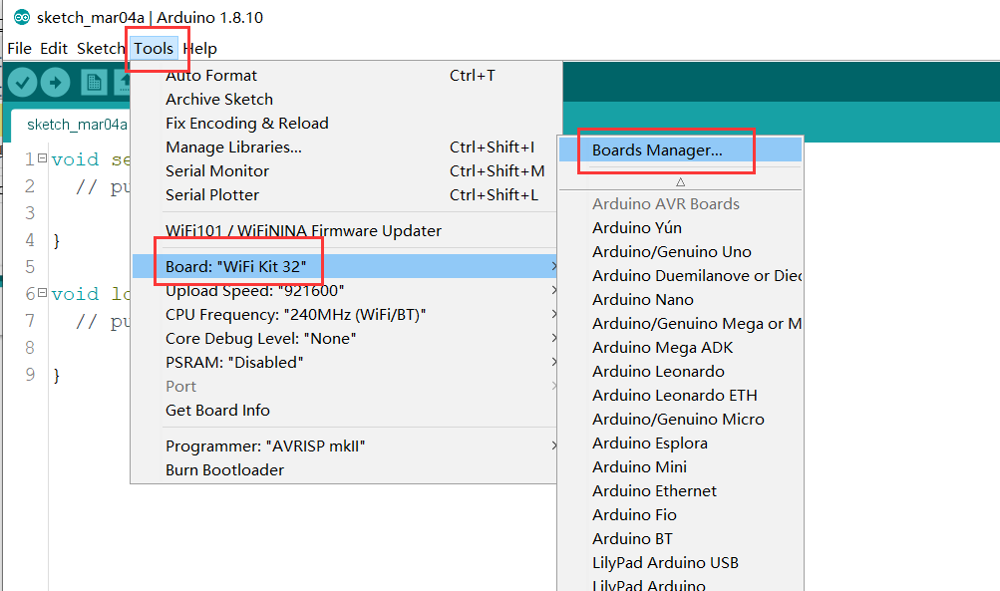
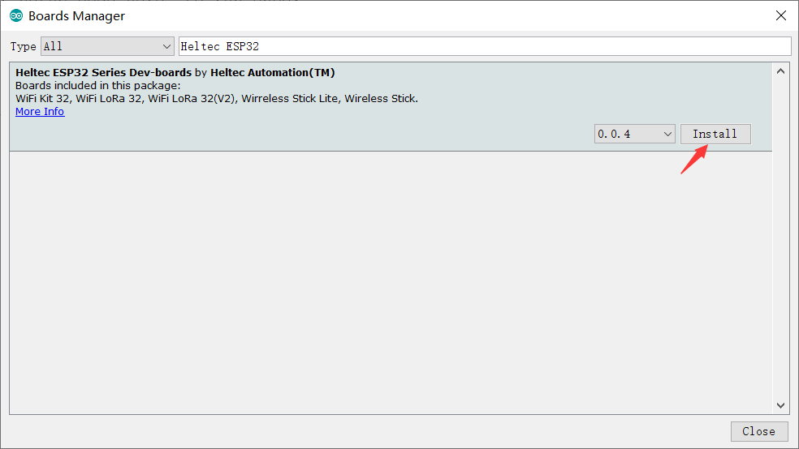
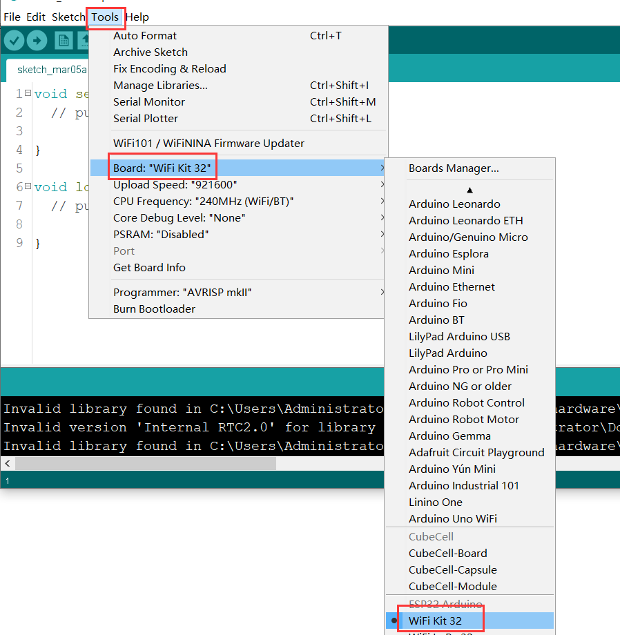
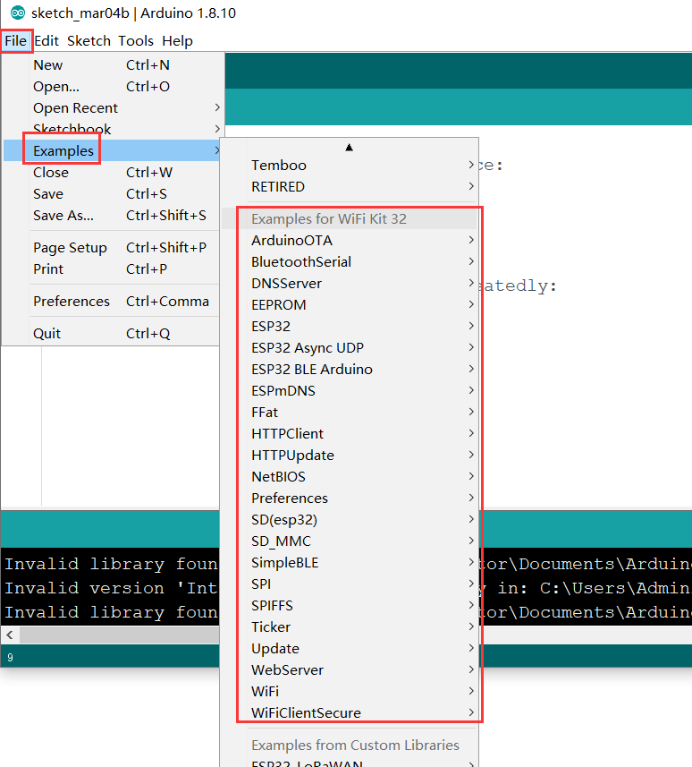

# Heltec ESP32+Arduino Series Quick Start

We suggest you confirm whether the `USB driver`, `Git` and `Arduino IDE` has installed first. If not, please view this two articles [establish serial connection](https://heltec-automation-docs.readthedocs.io/en/latest/general/establish_serial_connection.html) and [Install Git and Arduino IDE](https://heltec-automation-docs.readthedocs.io/en/latest/general/how_to_install_git_and_arduino.html).

## Setting Environment

### Via Arduino IDE

Only two steps to complete setting.

**Step1. Download Arduino-ESP32 Support**

- Open Arduino IDE, and click `File`->`Peferences`


**Input the last ESP32 package URL:** [http://resource.heltec.cn/download/package_heltec_esp32_index.json](http://resource.heltec.cn/download/package_heltec_esp32_index.json)



- Click `Tools`->`Board:`->`Boards Manager...`, search `Heltec ESP32` in the new pop-up dialog, then click `install`





The source code of Heltec ESP series (ESP32 & ESP8266) framework available here: [https://github.com/Heltec-Aaron-Lee/WiFi_Kit_series](https://github.com/Heltec-Aaron-Lee/WiFi_Kit_series)

**Step2. Download the Heltec ESP32 Library**

- Open Arduino IDE, then Select `Sketch`->`Include Library`->`Manage Libraries...`
  Search `Heltec ESP32` and install it


The source code of `Heltec ESP32` library available here:[https://github.com/HelTecAutomation/Heltec_ESP32](https://github.com/HelTecAutomation/Heltec_ESP32)

### Via Git

1. Download and install Git from [git-scm.com](https://git-scm.com/downloads).

```Tip:: If you don't install Git, go to "https://github.com/Heltec-Aaron-Lee/WiFi_Kit_series" and choose "Download ZIP", Unzip the file to "C:\Users\Administrator\Documents\Arduino\hardware". Skip step two to step four.

```


2. Enter the path of `C:\Users\Administrator\Documents\Arduino\hardware  ` , Right click and Start ```Git Bash``` .

3. Input `git clone https://github.com/Heltec-Aaron-Lee/WiFi_Kit_series.git` and wait for it to download properly.


4. Open`C:\Users\Administrator\Documents\Arduino\hardware\WiFi_Kit_series\esp32\tools` and double-click `get.exe` .


5. When ```get.exe``` finishes, you should see the following files in the directory.


```Tip:: If the download fails, you need to run "get.py" again.

```

The Heltec ESP32 Library has been downloaded through the above steps, you can see it in the `esp32` folder.


&nbsp;

## Example

This section is used to verify that Arduino programming can be used and that the environment is configured successfully.

- Select  `Wifi Kit 32`  development board



- Select the corresponding example and upload.



If the screen or serial port has output, it means that the board runs successfully!