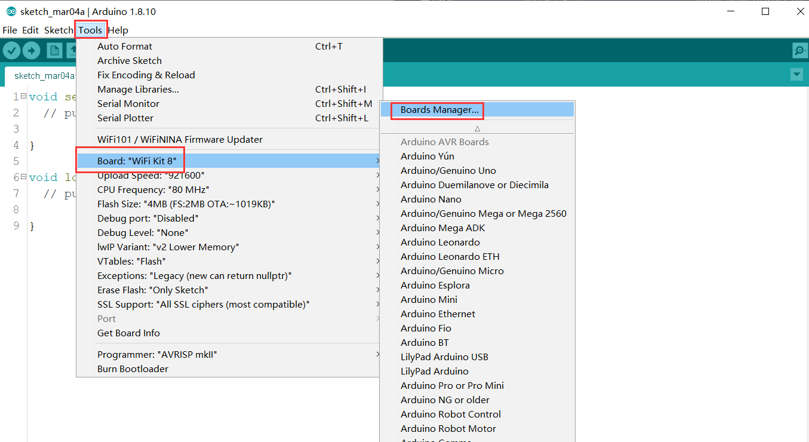
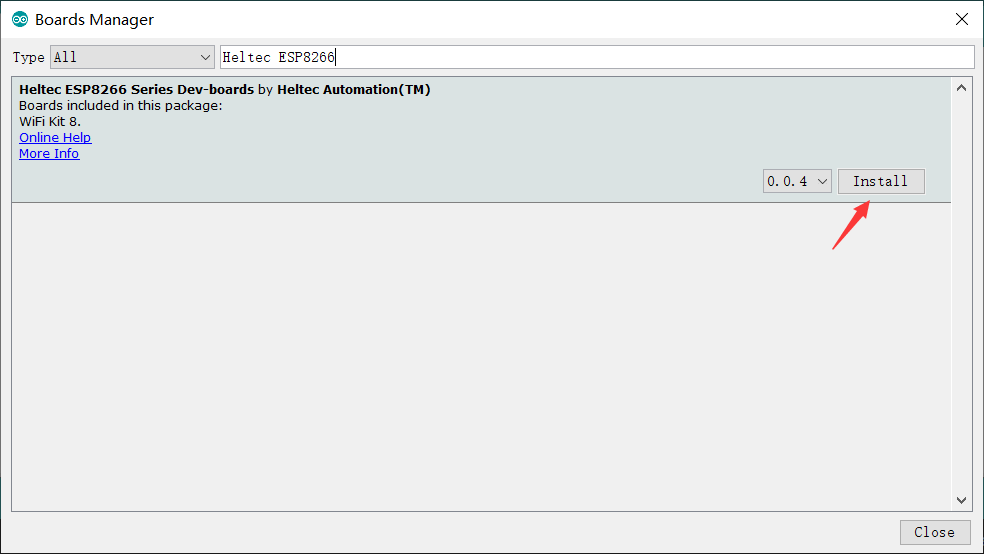

# Heltec ESP32/ESP8266+WIFI Series Quick Start

We suggest you confirm whether the `USB driver`, `Git` and `Arduino IDE` has installed first. If not, please view this two articles [establish serial connection](https://heltec-automation-docs.readthedocs.io/en/latest/general/establish_serial_connection.html) and [Install Git and Arduino IDE](https://heltec-automation-docs.readthedocs.io/en/latest/general/how_to_install_git_and_arduino.html).

## Setting Environment

### Download Arduino-ESP32 Support

- Open Arduino IDE, and click `File`->`Peferences`

Input last esp8266 board manager URL

**Now the last board manager URL:**  https://github.com/Heltec-Aaron-Lee/WiFi_Kit_series/releases/download/0.0.4/package_heltec_esp8266_index.json

Click `Tools`->`Board:`->`Boards Manager...`, search `Heltec ` in the new pop-up dialog, then click `install`

The source code of Heltec ESP series (ESP32 & ESP8266) framework available here: [https://github.com/Heltec-Aaron-Lee/WiFi_Kit_series](https://github.com/Heltec-Aaron-Lee/WiFi_Kit_series)

### Download the Heltec ESP8266 Library

Open Arduino IDE, then Select `Sketch`->`Include Library`->`Manage Libraries...`
Search `Heltec ESP8266` and install it

!

The source code of `Heltec ESP8266` library available here:[https://github.com/HelTecAutomation/Heltec_ESP8266](https://github.com/HelTecAutomation/Heltec_ESP8266)

## Example

This section is used to verify that Arduino programming can be used and that the environment is configured successfully.

- Select `Wifi Kit 8` development board

- Select the corresponding example and upload.

If the screen or serial port has output, it means that the board runs successfully!