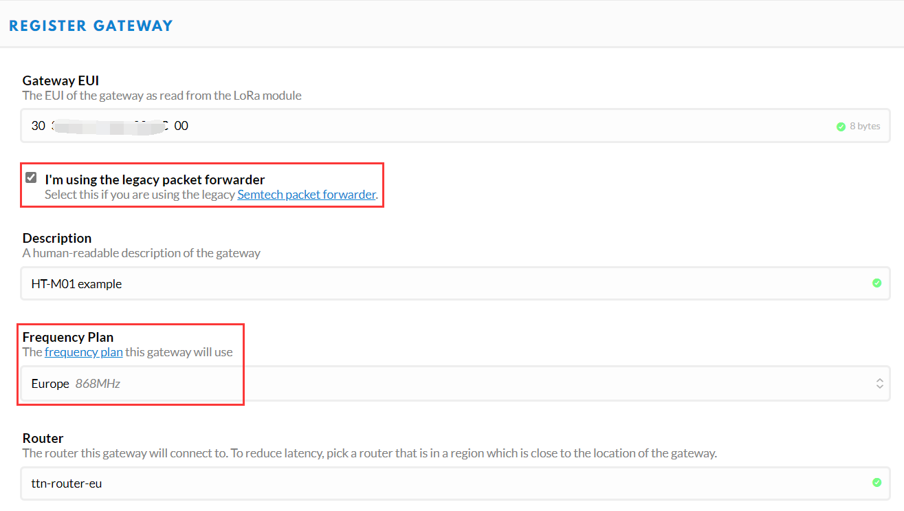
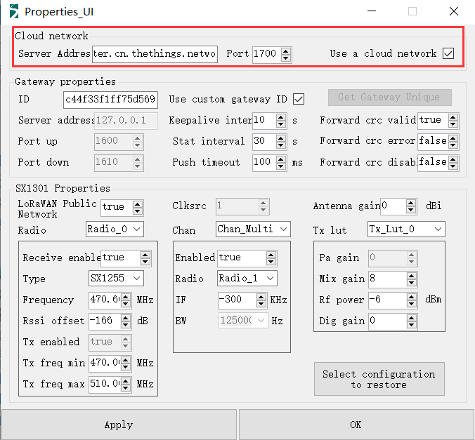
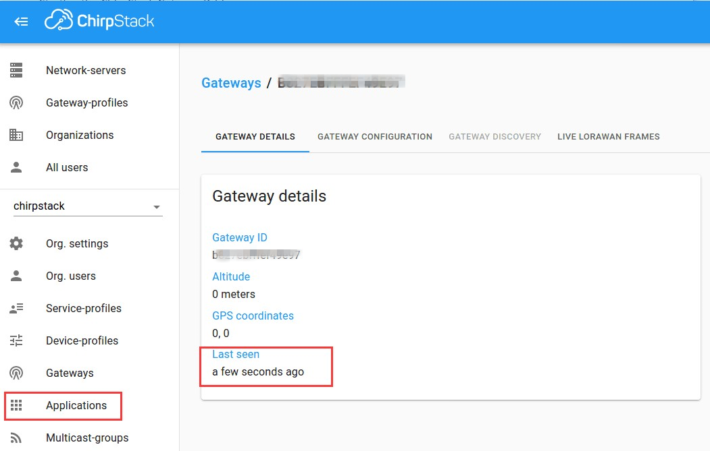

# Connect HT-M01 to a LoRa Server
[简体中文](https://heltec-automation.readthedocs.io/zh_CN/latest/gateway/ht-m01/connect_to_server.html)
## Summary

This article aims to describe how to connect [HT-M01 Gateway](https://heltec.org/project/ht-m01) to a LoRa server, such as [TTN](https://www.thethingsnetwork.org/), [ChripStack](https://www.chirpstack.io/), which facilitates secondary development and rapid deployment of LoRa devices.

Before all operation, make sure the HT-M01 is runing well with a Raspberry Pi (Linux) or Windows computer. If not, please refer to this [HT-M01 Quick Start](./quick_start.md) document.

## Connect to TTN

### Register a LoRa gateway in TTN

Create and active an account in TTN. Select ```Gateway``` in the [console](https://console.thethingsnetwork.org/) page.


Fill in the HT-M01 information as shown below and complete the addition.



- **Gateway EUI** -- The unique ID of HT-M01 gateway;
- **I'm using the legacy packet forwarder** -- Must select this;
- **Frequency Plan** -- Must matach the LoRa band configuration (`global_conf.json`) in HT-M01.
- **Router** -- Must use the default router allocated by TTN system.

``` Tip:: That four points are the key to success connection with TTN.

```


### Connecting

Users only need config the server address and port in the Raspberry Pi *(for HT-M01 gateway)*.

The TTN's router addresses for different region:

[https://www.thethingsnetwork.org/docs/gateways/packet-forwarder/semtech-udp.html#router-addresses](https://www.thethingsnetwork.org/docs/gateways/packet-forwarder/semtech-udp.html#router-addresses)

#### HT-M01 in Linux (Raspberry Pi)

Fix parameters in `global_conf.json`:

```shell
  nano /home/pi/lora/packet_forwarder/lora_pkt_fwd/global_conf.json
```

  At the end of the `global_conf.json`, make these changes:


  ```json
  “server_address”: “router.eu.thethings.network”, /*The router addresses need matach your region*/
  “serv_port_up”: 1700,
  “serv_port_down”: 1700,
  ```

`ctrl + O` to save and `ctrl + X` to exit, and restart the service in Raspberry Pi:

```shell
sudo systemctl restart lrgateway
```


#### HT-M01 in Windows

Select `Use a cloud network`, and fill in correct `server address`, keep `Port` default 1700.



Click `OK` and `Start Packet Forwarder`.


&nbsp;

Now go back to TTN, it is runing:


&nbsp;

## Connect to ChripStack server

[ChripStack](https://www.chirpstack.io/) is the most popular LoRa server open source project, widely used in many fields, and also the best choise for a private LoRa server.

- ChripStack Installation guide: [https://www.chirpstack.io/overview/](https://www.chirpstack.io/overview/)
- ChripStack support forum: [https://forum.chirpstack.io/](https://forum.chirpstack.io/)

### ChirpStack Gateway Bridge

**One thing need attention!** the ChripStack need a special service named `Gateway Bridge`, which converts LoRa® Packet Forwarder protocols into a ChirpStack Network Server [common data-format](https://github.com/brocaar/chirpstack-network-server/blob/master/api/gw/gw.proto) (JSON and Protobuf).

the `Gateway Bridge` service can running on the Raspberry Pi or the ChirpStack server. We recommend install it on the Raspberry Pi.

Install ChirpStack Gateway Bridge: [https://www.chirpstack.io/gateway-bridge/install/debian/](https://www.chirpstack.io/gateway-bridge/install/debian/)

Starting the ChirpStack Gateway Bridge:

```shell
sudo systemctl start chirpstack-gateway-bridge
```

### Connecting

Modify the parameters of the `global_conf.json` file:

```shell
sudo nano ~/lora/packet_forwarder/lora_pkt_fwd/global_conf.json
```

  At the end of the `global_conf.json`, make these changes:

```json
  “gateway_ID”: “XXXXXXXXXXXXXXXX”, /*Your gateway ID, 16 characters*/
/*
   - If the ChirpStack Gateway Bridge runing on Raspberry Pi, server_address should be "localhost";
   - If the ChirpStack Gateway Bridge runing on Raspberry Pi, server_address should be the ChirpStack's IP address.
*/
  “server_address”: “localhost”,
  “serv_port_up”: 1700,
  “serv_port_down”: 1700,
```

Gateway Bridge running on Raspberry Pi, the data flow 

`ctrl + O` to save and `ctrl + X` to exit, and restart the service in Raspberry Pi:

```shell
sudo systemctl restart lrgateway
```

&nbsp;

Now, back to ChirpStack server, it is running.



