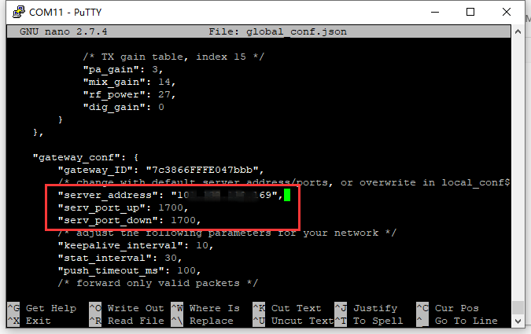
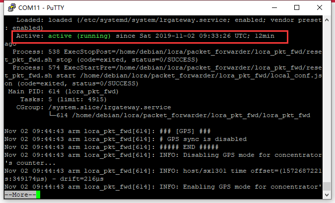
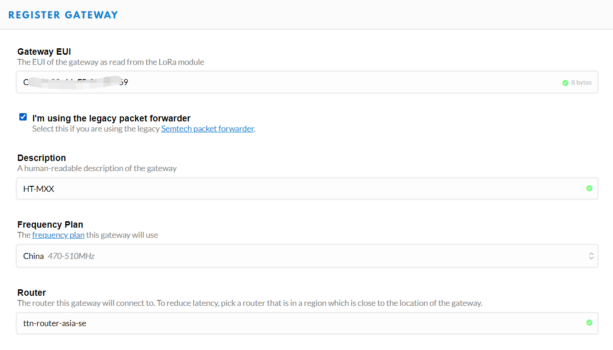
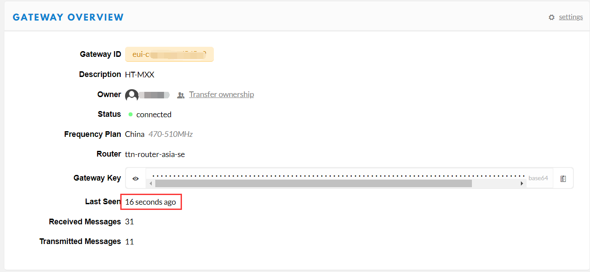
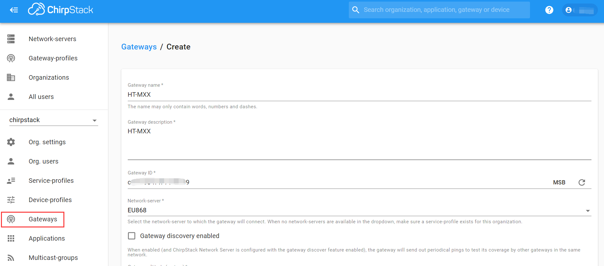

# Connect HT-M02 to a LoRa Server
[简体中文]()

## Summary

This article aims to describe how to connect [HT-M02 Gateway]() to a LoRa server, such as [TTN](https://www.thethingsnetwork.org/), [ChirpStack](https://www.chirpstack.io/), which facilitates secondary development and rapid deployment of LoRa devices.

Before all operation, make sure the HT-M02 is runing well . If not, please refer to this [HT-M02(POE) Quick Start]() document.

&nbsp;

Connect HT-M02 to LoRa server, users only need config the `server address` and `port` in `global_conf.json`:

```shell
sudo nano lora/packet_forwarder/lora_pkt_fwd/global_conf.json
```

At the end of this file, make suitable changes:

```json
  “server_address”: “router.eu.thethings.network”, /*The server IP address or domain*/
  “serv_port_up”: 1700,
  “serv_port_down”: 1700,
```



`ctrl + O` to save and `ctrl + X` to exit, and restart the service:

```shell
sudo systemctl restart lrgateway
```

Check whether the system running normally:

```shell
sudo systemctl status lrgateway
```



&nbsp;

## Connect to TTN

### Register a LoRa gateway in TTN

Create and active an account in TTN. Select ```Gateway``` in the [console](https://console.thethingsnetwork.org/) page.


Fill in the HT-M02 information as shown below and complete the addition.



- **Gateway EUI** -- The unique ID of HT-M02 gateway;
- **I'm using the legacy packet forwarder** -- Must select this;
- **Frequency Plan** -- Must matach the LoRa band configuration in HT-M02；
- **Router** -- Must use the default router allocated by TTN system.

``` Tip:: That four points are the key to success connection with TTN.

```


### Connecting

In the HT-M02 gateway, only the server address and port need to be configured.

The TTN's router addresses for different region:

[https://www.thethingsnetwork.org/docs/gateways/packet-forwarder/semtech-udp.html#router-addresses](https://www.thethingsnetwork.org/docs/gateways/packet-forwarder/semtech-udp.html#router-addresses)


View gateway status, it is runing:：



&nbsp;

## Connect to ChirpStack server

[ChirpStack](https://www.chirpstack.io/) is the most popular LoRa server open source project, widely used in many fields, and also the best choise for a private LoRa server.

- ChirpStack Installation guide: [https://www.chirpstack.io/overview/](https://www.chirpstack.io/overview/)
- ChirpStack support forum: [https://forum.chirpstack.io/](https://forum.chirpstack.io/)

### ChirpStack Gateway Bridge

**One thing need attention!** the ChirpStack need a special service named `Gateway Bridge`, which converts LoRa® Packet Forwarder protocols into a ChirpStack Network Server common data-format(JSON and Protobuf).

the `Gateway Bridge` service can running on the Raspberry Pi or the ChirpStack server.

Install ChirpStack Gateway Bridge: [https://www.chirpstack.io/gateway-bridge/install/debian/](https://www.chirpstack.io/gateway-bridge/install/debian/)

### Register LoRa Gateway in ChirpStack

Fill in the HT-M02 information as shown below and complete the addition.



- **Gateway ID** -- The unique ID of the HT-M02 gateway.

View gateway status, it is runing:


&nbsp;

&nbsp; 

## Connect to HelTec server

Coming soon.