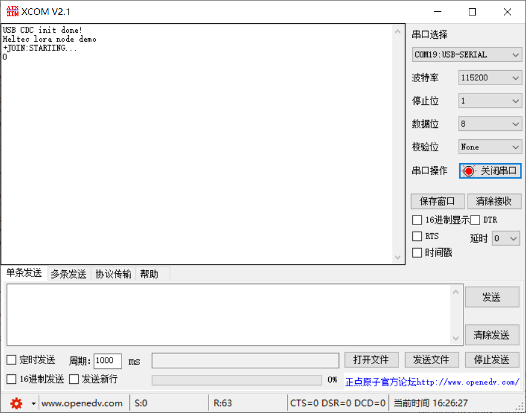

# Establish Serial Connection

The LoRa Node can print debugging information through USB-CDC (USB-Virtual Serial Poart) or UART, but the USB to UART chip is not integrated on the board. If the debugging information is to be output through the UART, an external USB to UART module is required.

## Use UART

- Open the example of we provided.
- Right-click the project to open `Properties`.


- Add `USE_DEBUGGER` in macro definitions, compile and download program.


- Connect the board and USB-UART module correctly.

```Tip:: The LoRa Node and USB-UART module are connect as below (if the LoRa Node is powered via USB or battery, the UART module&#39;s 3.3 / 5V pin do not need connect, just need TXD, RXD, GND).

```


```Tip:: When using UART, the TX and RX pins used in the program should be corresponding to the TX and RX pins on the board. In the routine we provide, we use TX-PA9 and RX-PA10. Therefore, TX of UART module should be connected to TX(PA9) of board, RX of UART module should be connected to RX(PA10) of board.

```

- Open serial port.

  

&nbsp;

## Use virtual serial port

- Open the example of we provided.
- Right-click the project to open `Properties`.


- Add `USB_VCP` and `USE_DEBUGGER`  in macro definitions, compile and download program.	


- Connect LoRa Node to computer via a Micro USB cable and open serial port.

